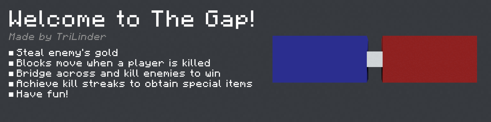

The Gap is an action-paced Minecraft PVP minigame playing out on a moving structure above the void between two team walls. The structure moves when a player dies. Kill enemies or bridge across to get to the enemy wall, break the gold blocks, and win.

You can watch the video trailer [here](https://www.youtube.com/watch?v=opldnz5Xdrk).

---

    <b>Play The Gap on a free Minecraft server</b>
    <a href="https://trial.stickypiston.co/map/thegap" target="_blank">
        
        https://trial.stickypiston.co/map/thegap
    </a>

---

This repository is for the data pack used in The Gap (which doesn't work on its own)

You can [download](https://github.com/TriLinder/TheGap/releases/latest/download/TheGap.zip) the full map under the releases tab.
